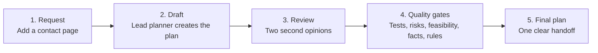
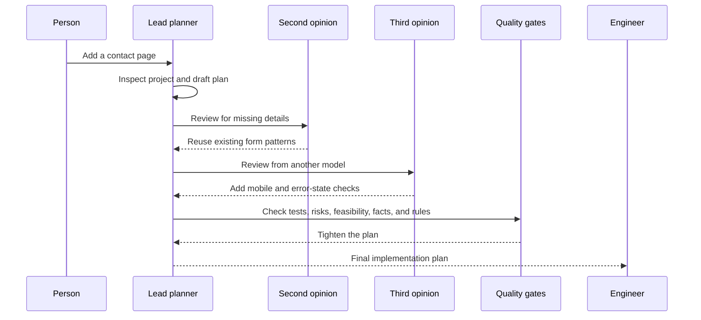
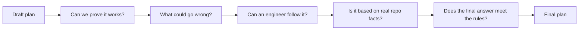

# Non-Technical Agent Demo

This walkthrough is for stakeholders who want to understand what the agent chain does without reading prompts, config files, or implementation rules.

For the clearest presentation experience, open the standalone browser demo at `../demo/index.html`.

## 30-Second Explanation

One lead agent creates the plan. Other agents review that plan for missing details, test coverage, risk, feasibility, factual accuracy, and final-answer quality. The lead agent then returns one clean final plan.

The reviewer outputs in this document are illustrative sample results, not live transcripts.

## Demo Scenario

A small business asks:

> Add a simple contact page to our website with a form, opening hours, and a map link.

The system does not immediately change the website. It first prepares a safer implementation plan so an engineer knows what to build, how to test it, and how to undo it if needed.

## What Happens In 5 Steps

1. The person asks for a change.
2. The lead planner drafts an implementation plan.
3. Two independent reviewers look for better options or missing details.
4. Quality gates check validation, risk, feasibility, facts, and final-answer rules.
5. The lead planner returns one final plan for the engineer.

## Simple Architecture

## Agent Legend

| Friendly name | Agent ID | What it adds |
| --- | --- | --- |
| Lead planner | `ping-pong-plan` | Owns the final plan and decides what feedback to use. |
| Second opinion | `plan-improver-model2` | Looks for missing details or a better implementation path. |
| Third opinion | `plan-improver-model3` | Gives another independent review from a different model. |
| Validation designer | `plan-validation-designer` | Defines how to prove the work is complete. |
| Risk reviewer | `plan-red-team-gate` | Finds blockers, hidden risks, and unnecessary scope. |
| Implementation dry run | `plan-implementation-simulator` | Checks whether an engineer can follow the plan. |
| Fact checker | `plan-fact-auditor` | Checks that repo claims are real or clearly labeled as assumptions. |
| Final quality checker | `plan-contract-checker` | Confirms the final plan has the required structure and no leaked review notes. |

## Demo Walkthrough

## Quality Gates

## Request To Final Plan Example

| Stage | What the audience sees |
| --- | --- |
| User request | "Add a simple contact page with a form, opening hours, and a map link." |
| Draft plan | "Create the page, reuse existing site patterns, add form fields, and include tests." |
| Reviewer feedback | "Check for an existing form component. Add mobile and error-state checks." |
| Quality-gate feedback | "Avoid unrequested CRM or email integrations. Make pass/fail checks concrete." |
| Final handoff | "A single implementation plan with steps, validation, risks, rollback, and no blocking open questions." |

## What Each Agent Adds

### 1. Lead Planner

**Called when:** the user first asks for the change.

**Sample result:** "Create a contact page using existing website patterns. Include name, email, message, opening hours, and a map link. Validate page load, empty-field errors, and success confirmation."

**Takeaway:** one agent owns the final plan, so the output is not a confusing pile of reviewer notes.

### 2. Second Opinion

**Called when:** the lead planner has a first complete plan.

**Sample result:** "Before adding a new form component, inspect whether the site already has one. Reuse it if possible."

**Takeaway:** the system reduces avoidable rework.

### 3. Third Opinion

**Called when:** the second opinion has also been requested.

**Sample result:** "Add checks for mobile layout and form error states."

**Takeaway:** different reviewers catch different gaps.

### 4. Validation Designer

**Called when:** the lead planner has merged useful reviewer feedback.

**Sample result:** "The page loads, required fields show errors when empty, valid input shows confirmation, and navigation includes the contact page."

**Takeaway:** the plan includes clear pass/fail checks.

### 5. Risk Reviewer

**Called when:** validation has been added.

**Sample result:** "Do not add email delivery, CRM syncing, or analytics unless the user asks for them."

**Takeaway:** the process prevents accidental overbuilding.

### 6. Implementation Dry Run

**Called when:** the plan is close to final.

**Sample result:** "Name the likely route, page component, shared form component, navigation, and test areas."

**Takeaway:** unclear instructions are caught before handoff.

### 7. Fact Checker

**Called when:** the plan has passed the implementation dry run.

**Sample result:** "If the routing framework has not been inspected, label routing details as assumptions."

**Takeaway:** the final plan separates known facts from guesses.

### 8. Final Quality Checker

**Called last:** immediately before the final plan is returned.

**Sample result:** "The final plan includes a goal, assumptions, steps, validation, rollback, and no blocking open questions."

**Takeaway:** stakeholders see one clean plan, not the internal review process.

## Presenter Script

### 30-Second Version

"This is a planning chain. One lead agent writes the plan, then specialist reviewers check it for missing details, tests, risk, feasibility, facts, and final quality. The important part is that the reviewers do not each produce a separate final answer. The lead agent combines useful feedback and returns one clear plan."

### 3-Minute Version

1. "We start with a familiar request: add a contact page."
2. "The lead planner drafts the implementation plan before anyone changes code."
3. "Two independent reviewers look for missing details, like reusing an existing form component or checking mobile behavior."
4. "Then quality gates ask practical questions: Can we prove it works? What could go wrong? Can an engineer follow the steps? Are claims based on real repo facts? Does the final answer meet our rules?"
5. "The final output is one implementation plan with steps, validation, risks, rollback, and no blocking open questions."

## Important Notes

- The sample results are illustrative, not live transcripts.
- The lead planner owns the final plan.
- Reviewer agents provide evidence and suggestions, not final decisions.
- Internal review notes stay hidden from the final user-facing answer.
