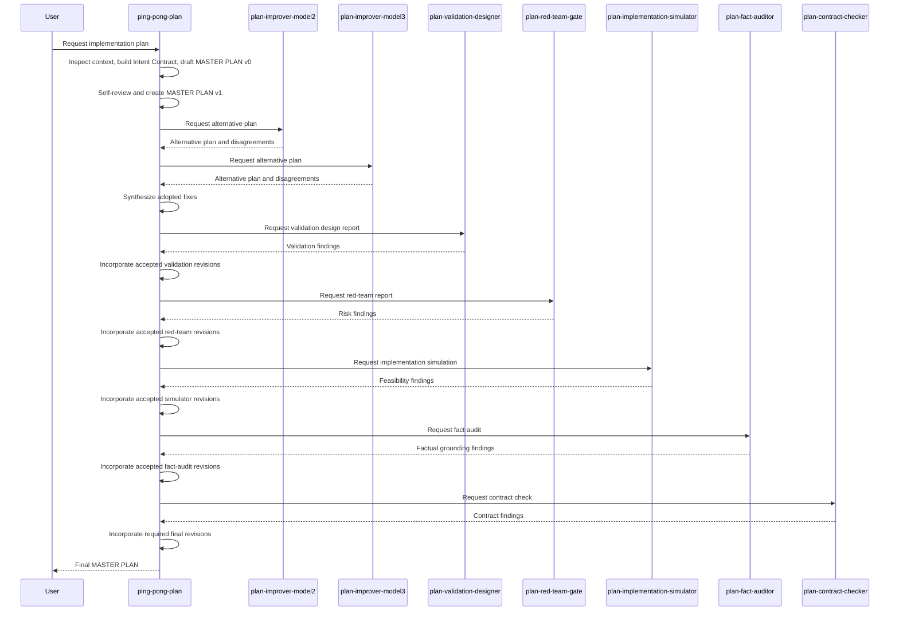

# Ping-Pong Plan Agent Flow

This document describes the `.opencode` ping-pong planning agent chain.

The flow is built for local models and intentionally prioritizes plan quality over speed or token cost. The goal is to produce one implementation-ready written `MASTER PLAN` that is grounded in repo facts, has concrete validation, and can be handed to an implementer without exposing internal review transcripts.

For a stakeholder-friendly walkthrough with diagrams and sample agent result cards, see `NON_TECH_AGENT_DEMO.md`.

## Core Model

`ping-pong-plan` is model 1 and the only owner of the canonical `MASTER PLAN`.

`ping-pong-plan` is planning-only. It must never edit, write, create, delete, move, rename, format, stage, patch, or otherwise modify project files. If the user asks it to fix or change files, it should produce a written plan for that future implementation. Actual file changes belong in a fresh `ping-ping-build` session.

All other agents are read-only evidence providers. They can inspect repo context with read-only tools and return alternative plans or structured reports, but they never replace the canonical plan directly.

The coordinator must:

- create, revise, and finalize the `MASTER PLAN` itself
- build an internal Intent Contract before drafting
- complete a Context Sufficiency Check before drafting
- pass a structured `KNOWN CONTEXT` bundle to subagents
- separate repo facts, assumptions, unresolved uncertainty, and not-inspected areas
- classify every important subagent finding in one internal Decision Ledger
- resolve severe gate verdicts in the plan text before advancing unless contradicted by repo facts or user scope
- prefer user intent, repo facts, implementation safety, and validation quality over consensus
- keep reports, ledgers, transcripts, and hidden process notes out of the final answer

## Agents

| Agent | Role | Skill | Output |
| --- | --- | --- | --- |
| `ping-pong-plan` | Master coordinator and only canonical plan author. | All specialty skills as internal checklists. | Final `MASTER PLAN`. |
| `plan-improver-model2` | Second-model alternative planner. | `plan-improvement-scout` | Complete alternative plan, key differences, blockers or major disagreements. |
| `plan-improver-model3` | Third-model alternative planner. | `plan-improvement-scout` | Complete alternative plan, key differences, blockers or major disagreements. |
| `plan-validation-designer` | Validation strategist before red-team review. | `validation-gap-finder` | Validation design report. |
| `plan-red-team-gate` | Risk, blocker, ambiguity, validation, and scope-creep reviewer. | `red-team-leftover-gate` | Red-team gate report. |
| `plan-implementation-simulator` | Dry-run reviewer for implementation feasibility. | `implementation-dry-run` | Implementation simulation report. |
| `plan-fact-auditor` | Factual grounding reviewer. | `fact-grounding-auditor` | Fact audit report. |
| `plan-contract-checker` | Final protocol, ownership, format, leakage, scope, validation, and rollback checker. | `plan-contract-guard` | Plan contract report. |

`subagent-router` is a separate primary utility agent for one-off reviewer feedback. It calls exactly one reviewer subagent with the required `description`, `prompt`, and `subagent_type` task payload shape. It is not part of the full ping-pong planning chain and does not replace `ping-pong-plan`.

## Specialty Skills

Specialty skills live under `.opencode/skills/<name>/SKILL.md` and are linked globally by `scripts/link-opencode-local.sh`. They are concise checklists that help the existing agents find improvement ideas, missing gaps, leftovers, validation weaknesses, factual issues, and contract problems.

Skills do not replace prompts, agents, task calls, or ownership rules:

- `ping-pong-plan` and `ping-ping-build` may use all six specialty skills as checklists.
- Each reviewer subagent may use only its mapped specialty skill.
- Skills never authorize reviewers to edit files, run bash, invoke tasks, or own the final answer.
- OpenCode sessions must be restarted after agent, prompt, config, or skill changes so the new skill registry and permissions are loaded.

## Ordered Flow

1. `ping-pong-plan` analyzes the user request, builds the internal Intent Contract, and completes the Context Sufficiency Check.
2. Model 1 drafts `MASTER PLAN v0`.
3. Model 1 self-reviews in the same context and updates to `MASTER PLAN v1`.
4. `plan-improver-model2` reviews `MASTER PLAN v1` and returns a self-reviewed alternative plan.
5. `plan-improver-model3` reviews `MASTER PLAN v1` and returns a self-reviewed alternative plan.
6. Model 1 synthesizes model2/model3 feedback into the canonical plan.
7. Model 1 runs bounded convergence only when a model raised a blocker, major contradiction, or clearly better structure that cannot be safely integrated without one same-model follow-up.
8. Model 1 creates `MASTER PLAN pre-validation`.
9. `plan-validation-designer` designs concrete validation and returns a validation report.
10. Model 1 incorporates accepted validation plan revisions and creates `MASTER PLAN pre-final`.
11. `plan-red-team-gate` reviews for blockers, high-risk ambiguity, missing validation, and scope creep.
12. Model 1 incorporates accepted red-team plan revisions and creates `MASTER PLAN near-final`.
13. `plan-implementation-simulator` dry-runs the plan as if implementing it.
14. Model 1 incorporates accepted simulator plan revisions and creates `MASTER PLAN fact-audit-candidate`.
15. `plan-fact-auditor` checks repo grounding, unsupported claims, assumptions, and validation command realism.
16. Model 1 incorporates accepted fact-audit plan revisions and creates `MASTER PLAN final-candidate`.
17. `plan-contract-checker` verifies the final candidate satisfies the planning contract and does not leak internal reports.
18. Model 1 incorporates required contract plan revisions and returns the final `MASTER PLAN`.

## Sequence Diagram

## Operating Rules

- The canonical plan is always called `MASTER PLAN`.
- Only `ping-pong-plan` may author the canonical plan.
- Subagent responses are evidence, not replacements.
- The internal Intent Contract captures the user goal, required scope, explicit non-goals, constraints, and conservative defaults before `MASTER PLAN v0`.
- The final plan must reflect the Intent Contract, but the Intent Contract is not exposed as a separate artifact.
- The final plan must be decision-complete and leave no implementation choices unresolved.
- Remaining open questions must be non-blocking or optional follow-up only.
- Majority agreement is useful but not binding.
- Scope creep is rejected even when multiple models suggest it.
- Every meaningful finding from model2/model3 and every gate is classified in one internal Decision Ledger as adopted, rejected, or deferred.
- Rejections and deferrals should be based on user-scope mismatch, contradicted repo facts, unnecessary risk, weak validation, over-engineering, unsupported commands, or missing information.
- Internal ledgers, raw reports, and subagent transcripts must never appear in the final answer.

## Severe Gate Handling

The coordinator may not advance past severe gate verdicts without fixing them, unless the finding is contradicted by repo facts or user scope and the reason is recorded in the internal Decision Ledger:

- `plan-validation-designer` verdict `Insufficient` blocks red-team review.
- Any `Blocking Issues` from `plan-red-team-gate` block implementation simulation.
- `plan-implementation-simulator` outcome `Blocked` blocks fact audit.
- `plan-fact-auditor` verdict `Fail` blocks contract checking.
- `plan-contract-checker` verdict `Fail` blocks final output.

## Context Sufficiency Check

Before `MASTER PLAN v0`, the coordinator must build a `KNOWN CONTEXT` bundle with:

- `Inspected`: files, prompts, configs, tests, docs, or modules inspected
- `Repo Facts`: concrete repo facts, including verified constraints and permissions
- `Assumptions`: assumptions that affect the plan
- `Unresolved Uncertainty`: unknowns and unverifiable claims
- `Validation Hints`: likely validation commands or checks, or a reason they are unknown
- `Not Inspected`: important not-inspected areas and why they were not inspected

If a central file, config, command, or ownership boundary is unknown, the coordinator should inspect more before drafting. If it still cannot verify a claim, it must label that claim as an assumption or uncertainty.

The same structured `KNOWN CONTEXT` headings should be used in every first-round, convergence, validation, red-team, simulator, fact-auditor, and contract-checker task payload.

## Tool And Permission Model

The coordinator can use:

- `read`
- `grep`
- `glob`
- `list`
- `task`
- the six specialty skills listed above

The coordinator cannot edit files, run shell commands, call web tools, ask questions, invoke arbitrary subagents, or invoke arbitrary skills during planning.

If the coordinator attempts an unavailable implementation tool such as `edit`, `write`, `bash`, `patch`, or `todowrite`, it must not retry that tool. The run should be treated as incomplete and recovered by starting a fresh `ping-ping-build` session when real file changes are wanted.

Subagents can use only read-only repo tools:

- `read`
- `grep`
- `glob`
- `list`
- their one mapped specialty skill

Subagents cannot edit files, write files, run bash, invoke tasks, invoke other subagents, invoke arbitrary skills, ask questions, call web tools, or claim ownership of the final plan.

## Final Output Contract

The final answer from `ping-pong-plan` must be only the final `MASTER PLAN` and should use these sections:

- `Goal`
- `Subagent Run Summary`
- `Assumptions`
- `Steps`
- `Files / Areas to Inspect`
- `Risks and Edge Cases`
- `Validation`
- `Rollback / Recovery`
- `Remaining Open Questions`

The final plan should be concise, concrete, implementation-ready, and free of internal gate reports or Decision Ledgers.

The `Subagent Run Summary` section must list all seven required reviewer subagents and mark each as succeeded, failed, or skipped. If any required reviewer did not run successfully, the `Goal` and `Rollback / Recovery` sections must say the ping-pong run is incomplete.

Blocking open questions are not allowed in the final plan. If a question would block implementation, validation, rollback, or file ownership, the coordinator must either choose a conservative default supported by user intent and repo facts or keep revising before final output.

The `Validation` section must include concrete automated checks or manual checks and a clearly labeled acceptance criteria subsection with observable pass/fail criteria.

## Evaluation Harness

Use `.opencode/evals/ping-pong-plan-benchmarks.md` to manually compare final plans against repeatable planning tasks. Score each run for decision completeness, repo grounding, validation quality, scope control, and implementability, and fail runs that ignore structured context, severe gate blockers, or concrete acceptance criteria.
