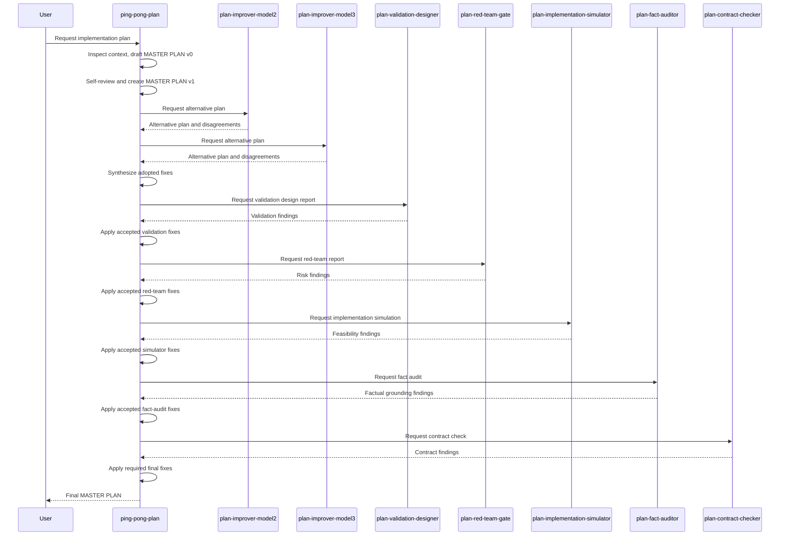

# Ping-Pong Plan Agent Flow

This document describes the `.opencode` ping-pong planning agent chain.

The flow is built for local models and intentionally prioritizes plan quality over speed or token cost. The goal is to produce one implementation-ready `MASTER PLAN` that is grounded in repo facts, has concrete validation, and can be handed to an implementer without exposing internal review transcripts.

## Core Model

`ping-pong-plan` is model 1 and the only owner of the canonical `MASTER PLAN`.

All other agents are read-only evidence providers. They can inspect repo context with read-only tools and return alternative plans or structured reports, but they never replace the canonical plan directly.

The coordinator must:

- create, revise, and finalize the `MASTER PLAN` itself
- inspect relevant repo context before planning when useful
- pass a concrete `KNOWN CONTEXT` bundle to subagents
- classify every important subagent finding as adopted, rejected, or deferred
- prefer user intent, repo facts, implementation safety, and validation quality over consensus
- keep reports, ledgers, transcripts, and hidden process notes out of the final answer

## Agents

| Agent | Role | Output |
| --- | --- | --- |
| `ping-pong-plan` | Master coordinator and only canonical plan author. | Final `MASTER PLAN`. |
| `plan-improver-model2` | Second-model alternative planner. | Complete alternative plan, key differences, blockers or major disagreements. |
| `plan-improver-model3` | Third-model alternative planner. | Complete alternative plan, key differences, blockers or major disagreements. |
| `plan-validation-designer` | Validation strategist before red-team review. | Validation design report. |
| `plan-red-team-gate` | Risk, blocker, ambiguity, validation, and scope-creep reviewer. | Red-team gate report. |
| `plan-implementation-simulator` | Dry-run reviewer for implementation feasibility. | Implementation simulation report. |
| `plan-fact-auditor` | Factual grounding reviewer. | Fact audit report. |
| `plan-contract-checker` | Final protocol, ownership, format, leakage, scope, validation, and rollback checker. | Plan contract report. |

## Ordered Flow

1. `ping-pong-plan` analyzes the user request and inspects relevant repo context.
2. Model 1 drafts `MASTER PLAN v0`.
3. Model 1 self-reviews in the same context and updates to `MASTER PLAN v1`.
4. `plan-improver-model2` reviews `MASTER PLAN v1` and returns a self-reviewed alternative plan.
5. `plan-improver-model3` reviews `MASTER PLAN v1` and returns a self-reviewed alternative plan.
6. Model 1 synthesizes model2/model3 feedback into the canonical plan.
7. Model 1 runs bounded convergence only when a model raised a blocker, major contradiction, or clearly better structure that cannot be safely integrated without one same-model follow-up.
8. Model 1 creates `MASTER PLAN pre-validation`.
9. `plan-validation-designer` designs concrete validation and returns a validation report.
10. Model 1 applies accepted validation fixes and creates `MASTER PLAN pre-final`.
11. `plan-red-team-gate` reviews for blockers, high-risk ambiguity, missing validation, and scope creep.
12. Model 1 applies accepted red-team fixes and creates `MASTER PLAN near-final`.
13. `plan-implementation-simulator` dry-runs the plan as if implementing it.
14. Model 1 applies accepted simulator fixes and creates `MASTER PLAN fact-audit-candidate`.
15. `plan-fact-auditor` checks repo grounding, unsupported claims, assumptions, and validation command realism.
16. Model 1 applies accepted fact-audit fixes and creates `MASTER PLAN final-candidate`.
17. `plan-contract-checker` verifies the final candidate satisfies the planning contract and does not leak internal reports.
18. Model 1 applies required contract fixes and returns the final `MASTER PLAN`.

## Sequence Diagram

## Operating Rules

- The canonical plan is always called `MASTER PLAN`.
- Only `ping-pong-plan` may author the canonical plan.
- Subagent responses are evidence, not replacements.
- Majority agreement is useful but not binding.
- Scope creep is rejected even when multiple models suggest it.
- Every meaningful finding from model2/model3 and every gate is classified as adopted, rejected, or deferred.
- Rejections and deferrals should be based on user-scope mismatch, contradicted repo facts, unnecessary risk, weak validation, over-engineering, unsupported commands, or missing information.
- Internal ledgers, raw reports, and subagent transcripts must never appear in the final answer.

## Tool And Permission Model

The coordinator can use:

- `read`
- `grep`
- `glob`
- `list`
- `task`

The coordinator cannot edit files, run shell commands, call web tools, ask questions, or invoke arbitrary subagents during planning.

Subagents can use only read-only repo tools:

- `read`
- `grep`
- `glob`
- `list`

Subagents cannot edit files, write files, run bash, invoke tasks, invoke other subagents, ask questions, call web tools, or claim ownership of the final plan.

## Final Output Contract

The final answer from `ping-pong-plan` must be only the final `MASTER PLAN` and should use these sections:

- `Goal`
- `Assumptions`
- `Steps`
- `Files / Areas to Inspect`
- `Risks and Edge Cases`
- `Validation`
- `Rollback / Recovery`
- `Remaining Open Questions`

The final plan should be concise, concrete, implementation-ready, and free of internal gate reports or synthesis ledgers.
